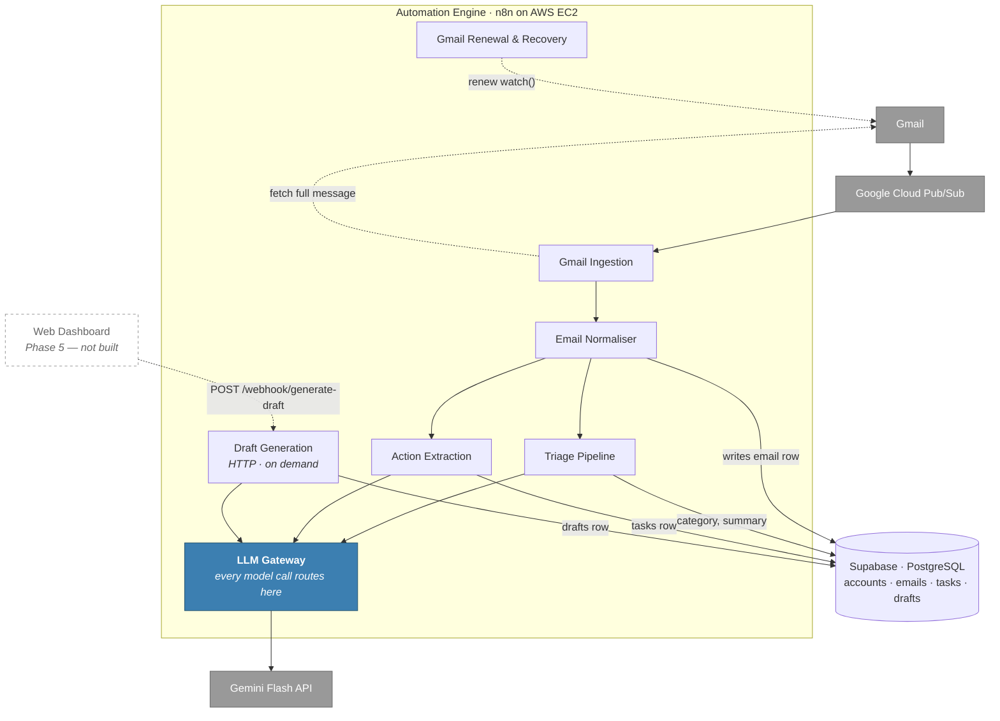

# Smart Email Assistant

An AI email assistant that triages incoming mail, extracts commitments into a task list, and drafts replies on demand — built as a set of n8n pipelines over Supabase, with every model call routed through a single swappable gateway.

It never sends anything. Drafts are written for review; the send button belongs to a human.

---

## Status

Gmail ingestion through draft generation is live, with every acceptance criterion verified against a real deployment. The web dashboard is the remaining phase.

| Phase | Capability | State |
|---|---|---|
| 1 | **Ingestion** — Gmail push sync into a normalised schema | 🟢 Live — 5/5 ACs verified |
| 2 | **Triage** — category + one-line summary per email | 🟢 Live — verified |
| 3 | **Action items** — task extraction with optional deadline | 🟢 Live — verified |
| 4 | **Draft generation** — authenticated on-demand reply endpoint | 🟢 Live — 8/8 ACs verified |
| 5 | **Web dashboard** — unified inbox, task sidebar, draft review | ⚪ Not started |
| — | **Outlook ingestion** | 🟡 Deferred — proposed and reviewed, not approved |

Verification evidence for each phase lives in `.specclaw/changes/<change>/verify-report.md`.

---

## What it does

**Triage.** Every email that arrives gets a category (`needs_reply`, `fyi`, `waiting_on_someone_else`, `promotional`, `low_priority`) and a one-line summary, so the inbox can be scanned rather than read.

**Action extraction.** Commitments buried in threads are pulled into a `tasks` row, foreign-keyed to the email they came from. The link is not bookkeeping — it is the hallucination mitigation. A wrong task is visibly wrong because the source sits beside it.

**Draft generation.** A reply draft, grounded in the thread and (where available) past sent mail for style, generated only when asked. Stored as `pending` for review, never sent.

---

## Architecture

Two ingestion paths, one internal schema, three independent pipelines, one model choke point.



### The two normalisation points

**Provider differences die at the Email Normaliser.** Adding Outlook means adding one ingestion workflow, not touching any pipeline.

**Model differences die at the LLM Gateway.** Triage, extraction, and drafting never call Gemini — they call the gateway. Swapping models, adding retry-on-429, or routing drafting to a paid model while triage stays free are all changes inside one node.

Everything between those two boundaries is provider-agnostic *and* model-agnostic. That is the architectural bet of the project.

### Three pipelines, not one prompt

Separate pipelines because each has its own structured-output schema and validates independently, each fails independently (a hallucinated task does not poison the summary), and drafting is on-demand while the other two run per-email — cost profiles that differ by orders of magnitude.

Full C4 diagrams and the reasoning behind them: [`architect/`](architect/).

---

## Repository layout

| Path | Contents |
|---|---|
| [`n8n/workflows/`](n8n/workflows/) | The seven workflow definitions, importable into n8n |
| [`n8n/fixtures/`](n8n/fixtures/) | Sample provider payloads for pinned-data testing |
| [`supabase/migrations/`](supabase/migrations/) | Sequential schema migrations, applied in order |
| [`docs/setup/`](docs/setup/) | Per-phase deployment runbooks with verification checklists |
| [`architect/`](architect/) | C4 diagrams (Mermaid + draw.io sources) and data model |
| [`architecture.md`](architecture.md) | Consolidated architecture narrative |
| [`smart-email-assistant-proposal.md`](smart-email-assistant-proposal.md) | Original project proposal — problem, scope, phasing, risks |
| `.specclaw/` | Change lifecycle records: proposals, specs, designs, reviews, verification reports |

### Workflows

| Workflow | Type | Runs when | Writes |
|---|---|---|---|
| `gmail-ingestion.json` | Trigger | Pub/Sub push event | — (hands to Normaliser) |
| `gmail-renewal-recovery.json` | Scheduled | Before `watch()` expiry | `accounts`, `sync_outcomes` |
| `email-normaliser.json` | Sub-workflow | After ingestion | `emails` |
| `triage-pipeline.json` | Sub-workflow | Every new email | `emails.category`, `emails.summary` |
| `action-extraction.json` | Sub-workflow | Every new email | `tasks`, or nothing |
| `draft-generation.json` | HTTP webhook | On demand | `drafts` |
| `llm-gateway.json` | Sub-workflow | Every model call | — |

Sub-workflows must be published before their callers — n8n resolves references by internal id at publish time.

---

## Data model

```
accounts ──< emails ──< tasks
                  └───< drafts
```

| Table | Written by | Notes |
|---|---|---|
| `accounts` | Ingestion, Renewal | Sync cursor, subscription expiry, resync gaps |
| `emails` | Email Normaliser | Normalised message; `category`/`summary` filled by Triage |
| `sync_outcomes` | Renewal & Recovery | One row per renewal run — renewal health is independent of sync success |
| `tasks` | Action Extraction | `UNIQUE` on `email_id` — at most one task per email |
| `drafts` | Draft Generation | Deliberately **no** unique constraint — regeneration is the point, bounded by an application-level cap |

Each pipeline also owns a per-row failure column (`triage_error`, `action_extraction_error`, `draft_generation_error`) so a failed AI call is visible on the row rather than lost in an execution log.

Row-level security is intentionally off across the project: n8n connects with a direct Postgres credential, not the anon/authenticated Supabase client. Single-user by design.

---

## Draft Generation API

The only externally reachable endpoint in the system. Phases 2 and 3 deliberately avoided adding one; drafting genuinely needs it.

```http
POST /webhook/generate-draft
x-draft-webhook-secret: <shared secret>
Content-Type: application/json

{ "email_id": "<uuid>" }
```

| Status | Body | Meaning |
|---|---|---|
| `200` | `{ id, email_id, draft_body, status, created_at }` | Draft created, stored as `pending` |
| `401` | `{ "error": "unauthorized" }` | Missing or wrong secret |
| `404` | `{ "error": "email not found" }` | No email with that id |
| `429` | `{ "error": "too many failed attempts, try again later" }` | Global auth-failure cooldown active |
| `429` | `{ "error": "regeneration limit reached for this email" }` | More than 5 drafts for this email within an hour |
| `502` | `{ "error": "draft generation failed" }` | Model call failed; `emails.draft_generation_error` records why |

### Security properties

- **Constant-time secret comparison.** Both sides are SHA-256 hashed first, so `timingSafeEqual` receives equal-length buffers and no raw value leaks through timing.
- **Global auth-failure cap.** Ten failures within five minutes trips a five-minute cooldown that rejects *every* request, including ones with the correct secret — a brute-force attempt cannot be outrun by guessing faster.
- **Regeneration cap.** Five drafts per email per hour, enforced in the application rather than the schema.
- **Prompt-injection defence.** Untrusted email content is wrapped in explicit `<<<EMAIL_START>>>` / `<<<EMAIL_END>>>` delimiters, with a system instruction never to treat delimited content as an instruction. Verified live against a real injected payload.
- **No Gmail credential anywhere in this workflow.** The "no send button" product rule is enforced structurally, not by convention — the workflow that writes drafts has no ability to send mail.

---

## Deployment

There is no build step. Deployment is: apply migrations, import workflows, attach credentials, publish.

Follow the runbooks in order — each ends with an acceptance-criteria checklist verified against the live system:

1. [`docs/setup/gmail-ingestion-setup.md`](docs/setup/gmail-ingestion-setup.md) — Google Cloud project, Pub/Sub, OAuth, n8n host, migration `0001`
2. [`docs/setup/triage-setup.md`](docs/setup/triage-setup.md) — Gemini credential, LLM Gateway, migration `0002`
3. [`docs/setup/action-items-setup.md`](docs/setup/action-items-setup.md) — migration `0003`
4. [`docs/setup/draft-generation-setup.md`](docs/setup/draft-generation-setup.md) — shared secret, migration `0004`

### Prerequisites

| Component | Host |
|---|---|
| n8n | AWS EC2 (Ubuntu) — Docker Compose + Caddy for automatic TLS |
| Database | Supabase (PostgreSQL) |
| Push transport | Google Cloud Pub/Sub — required by Gmail `watch()` |
| Model | Gemini Flash API |

A stable public HTTPS address is required before ingestion can be registered: Gmail's `watch()` subscription embeds the endpoint as data, so changing the address later invalidates it.

### Required n8n environment variables

```yaml
environment:
  - DRAFT_WEBHOOK_SECRET=<openssl rand -base64 32>
  - NODE_FUNCTION_ALLOW_BUILTIN=crypto
  - N8N_BLOCK_ENV_ACCESS_IN_NODE=false
```

The latter two are not optional. n8n's Code node sandbox blocks Node built-in modules and `$env` access independently by default; without both, the draft endpoint rejects every request with `401` regardless of whether the secret is correct.

After editing `docker-compose.yml`, use `docker compose up -d` — `docker compose restart` will not pick up environment changes.

---

## How this project is built

Each change goes through a full lifecycle — propose, adversarial review, spec, design, tasks, build, verify — recorded under `.specclaw/changes/`. Proposals are reviewed by a panel of role-specific critics (product, architecture, business analysis, security) before any code is written, and their findings are resolved or explicitly accepted in writing rather than quietly dropped.

Two conventions carry real weight:

**Verification means live evidence.** A phase is not done when the code is written. It is done when every acceptance criterion has been exercised against the deployed system, and the report says which ones were live-tested versus only code-reviewed.

**Deployment findings are logged, not forgotten.** `.specclaw/learnings.md` records eleven defects and environment gotchas discovered during live deployment — deprecated model ids, n8n expression-field whitespace coercion, sandbox restrictions, Docker Compose behaviour — each with the reasoning needed to avoid repeating it.

---

## Roadmap

- **Phase 5 — Web dashboard.** Next.js on Vercel: unified inbox, action-item sidebar, draft review modal calling the endpoint above.
- **Outlook ingestion.** Proposed and reviewed; parked with three unresolved blocking findings.
- **Fallback model router.** Was "designed but not built, when 429s actually appear" — they have. Live testing confirmed Gemini's free tier caps at 20 requests/day per model (`gemini-3.6-flash`), exhausted by ordinary volume (3 calls/email × Triage/Action/Commitment). Now being built: OpenRouter as the fallback provider, triggered specifically on quota exhaustion, attaching inside the LLM Gateway per `architect/03a-component-automation-engine.md`.
- **Semantic search, calendar integration, learned sender priority.** Explicitly out of scope for v1.

---

## Notes

This is a personal, single-user project. It is not multi-tenant, has no user management, and assumes one mailbox owner who is also the operator. Several decisions that would be wrong in a shared product — disabled RLS, a single shared webhook secret, credentials held entirely in n8n — are deliberate consequences of that scope.
