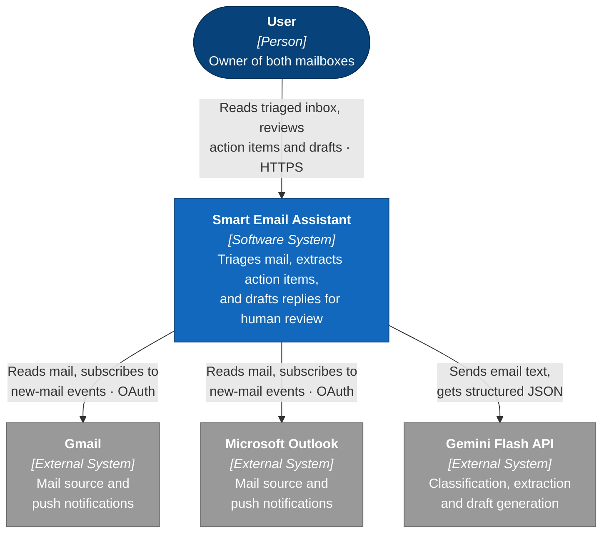

# L1 — System Context

**Editable source:** [01-system-context.drawio](01-system-context.drawio)

The widest view: one person, one system, three externals. If a box does not appear here, it does not exist at v1.

## Notes

**One user, deliberately.** Multi-tenancy is out of scope, so there is no tenant, no org, no sharing model. Anything that would only exist to support a second user does not belong in v1.

**Every provider arrow is read-only.** The system reads mail and subscribes to events. It never sends. That is a product rule, not a deferral — the human approves and sends from their real mail client.

**The Gemini arrow is the privacy decision.** Personal email content crosses this boundary to a third party, and it carries mail written by people who never agreed to that. The proposal flags this as needing a deliberate call *before Phase 2*: either a paid tier with no-training terms, or local Ollama for sensitive processing. The diagram shows the arrow honestly rather than hiding it inside the system box.

## What crosses each boundary

| Arrow | Data | Direction |
|---|---|---|
| User → System | Nothing sensitive; UI interaction | In |
| System ↔ Gmail | Mail bodies, headers, OAuth tokens | Both (pull + push) |
| System ↔ Outlook | Mail bodies, headers, OAuth tokens | Both (pull + push) |
| System → Gemini | Email body text, thread history, past sent mail | Out |

The last row is the only one leaving to a party with no relationship to the user's mailbox.
