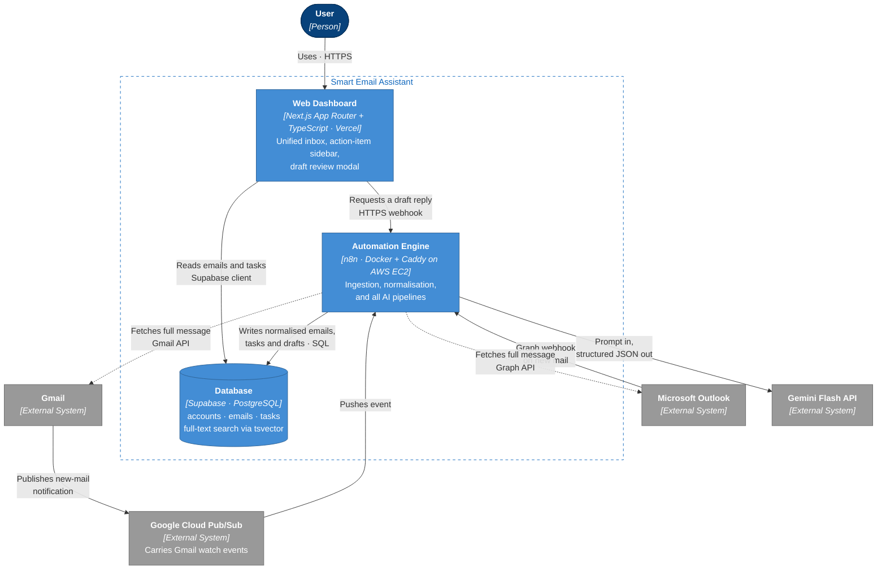

# L2 — Containers

**Editable source:** [02-container.drawio](02-container.drawio)

Zoom one level in: the three deployable pieces and how they talk.

## The three containers

| Container | Technology | Host | Responsibility |
|---|---|---|---|
| **Web Dashboard** | Next.js App Router, TypeScript | Vercel (free) | Everything the user sees. Reads only. |
| **Automation Engine** | n8n, Docker Compose + Caddy | AWS EC2 (free tier) | Every credential, every outbound call, every AI pipeline. |
| **Database** | Supabase / PostgreSQL | Supabase (free) | The contract between the other two. |

## Why the boundaries sit here

**n8n owns every credential.** OAuth tokens for both providers and the Gemini API key live in one container. The dashboard has none of them. If a provider changes its auth model, exactly one container changes.

**The database is the interface.** The dashboard does not ask n8n for the inbox — it reads Supabase directly. n8n does not render anything — it writes rows. Neither needs to be running for the other to be useful, and phases 1–4 are verifiable with no frontend at all.

**One synchronous call between containers.** The dashboard calls n8n for exactly one thing: draft generation, on demand. Everything else is asynchronous through the database. That single webhook is the only place where a slow n8n makes the UI wait.

## Push, never poll

| Provider | Mechanism | Path |
|---|---|---|
| Gmail | `watch()` → Google Cloud Pub/Sub | Gmail → Pub/Sub → n8n |
| Outlook | Microsoft Graph webhook subscription | Outlook → n8n |

Pub/Sub exists in the diagram only because Gmail requires it — Outlook posts to n8n directly. It is transport, not a component we designed.

Both subscriptions expire and must be renewed (Gmail's `watch()` within 7 days, Graph subscriptions on their own clock). That renewal job is n8n's, and it is the most likely silent failure in the whole system: nothing breaks loudly, mail just stops arriving.

## Deployment

| Container | Host | Tier | Operational burden |
|---|---|---|---|
| Web Dashboard | Vercel | Free | None — managed |
| Automation Engine | AWS EC2 (Ubuntu) | Free tier | **Self-managed**: TLS, patching, uptime |
| Database | Supabase | Free | None — managed |
| Pub/Sub transport | Google Cloud | Free | None — managed |

The EC2 instance is the only self-managed box and therefore the only real ops risk. Caddy handles TLS renewal automatically; ports 80/443/22 must be open in the instance's Security Group (AWS's cloud-level firewall) — the classic trap here is a Security Group inbound rule scoped to a single source IP that later moves (e.g. an ISP-assigned address changing), silently locking out SSH access.
