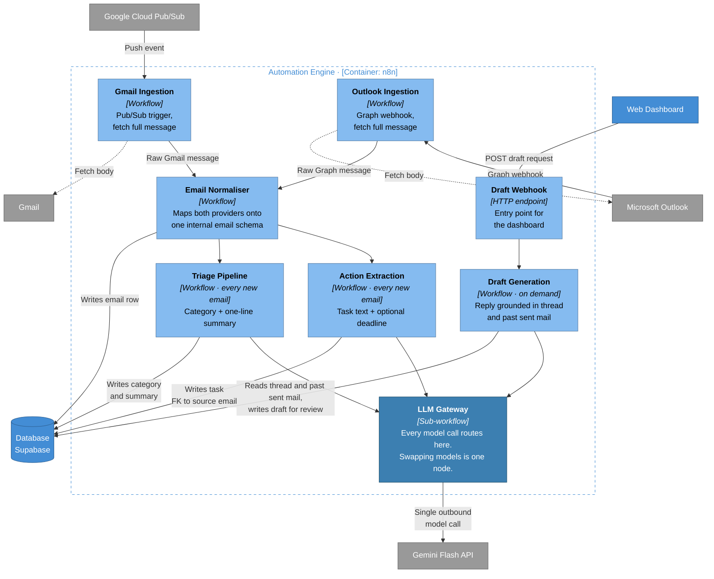

# L3a — Components: Automation Engine (n8n)

**Editable source:** [03a-component-automation-engine.drawio](03a-component-automation-engine.drawio)

Inside the n8n container. One workflow per box — the proposal's rule against visual spaghetti, drawn.

## Components

| Component | Type | Runs when | Writes |
|---|---|---|---|
| Gmail Ingestion | Workflow | Pub/Sub event | — (hands off to Normaliser) |
| Outlook Ingestion | Workflow | Graph webhook | — (hands off to Normaliser) |
| Email Normaliser | Workflow | After either ingestion | `emails` row |
| Triage Pipeline | Workflow | Every new email | `emails.category`, `emails.summary` |
| Action Extraction | Workflow | Every new email | `tasks` row, or nothing |
| Draft Generation | Workflow | On demand only | draft, for review |
| Draft Webhook | HTTP endpoint | Dashboard request | — (invokes Draft Generation) |
| **LLM Gateway** | Sub-workflow | Every AI call | — |

## The two normalisation points

This is the shape worth defending as the system grows.

**Provider differences die at the Email Normaliser.** Gmail and Outlook have different message formats, different id schemes, different threading semantics. Two ingestion workflows absorb that, and everything downstream sees one internal schema. Adding a third provider means adding one ingestion workflow — no pipeline changes.

**Model differences die at the LLM Gateway.** Triage, extraction and drafting never call Gemini. They call the gateway. Swapping the model, adding retry-on-429, adding a local Ollama fallback, or routing draft generation to a paid model while triage stays free — all of that is a change inside one box.

Everything between those two boxes is provider-agnostic *and* model-agnostic. That is the whole architectural bet of the project, and it is why the gateway is drawn in a different colour.

## Three pipelines, not one prompt

| Pipeline | Trigger | Output contract |
|---|---|---|
| Triage | Every new email | `{ category, summary }` |
| Action extraction | Every new email | `{ task_text, deadline? }` or none |
| Draft generation | On demand | `{ draft_body }` |

Separate pipelines rather than one large prompt, for three reasons the proposal implies: each has its own structured-output schema and can be validated independently; each fails independently (a hallucinated task does not poison the summary); and drafting is on-demand while the other two are per-email, so their cost profiles differ by orders of magnitude.

Triage and extraction fan out from the Normaliser in parallel — neither depends on the other's output.

## Where the fallback router goes

Not built in v1, and deliberately not drawn. When 429s actually appear, it becomes routing logic *inside* the LLM Gateway:

- **Primary** — Gemini Flash free tier, all pipelines
- **Fallback** — local Ollama 7B–14B for triage and extraction when rate-limited
- **Escalation** — small paid balance for draft generation only, if quality demands it

No pipeline changes when that day comes. That is the point of the choke point, and the reason it is worth enforcing on day one rather than retrofitting.

## Failure modes this diagram makes visible

- **Subscription expiry** — nothing in this container renews the Gmail `watch()` or the Graph subscription yet. When they lapse, no arrow fires and no error appears. Mail simply stops.
- **Ingestion succeeds, AI fails** — the email row exists with a null category. The inbox should render that state, not hide the email.
- **Draft generation is the only synchronous path** — it is the one place a slow model call is visible to a waiting human.
