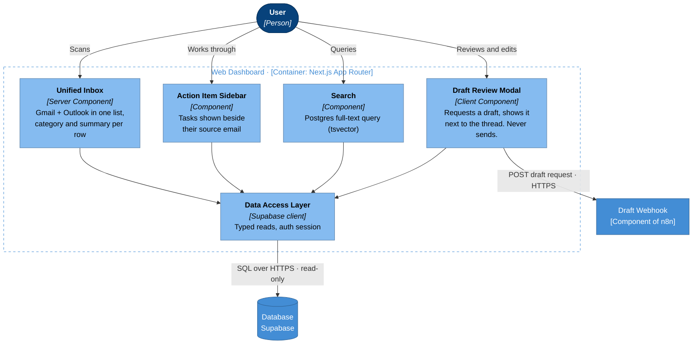

# L3b — Components: Web Dashboard (Next.js)

**Editable source:** [03b-component-web-dashboard.drawio](03b-component-web-dashboard.drawio)

Inside the Next.js container. Phase 5 of the delivery plan.

## Components

| Component | Type | Backed by |
|---|---|---|
| Unified Inbox | Server Component | `emails` — both providers in one list |
| Action Item Sidebar | Component | `tasks`, joined to source `emails` |
| Draft Review Modal | Client Component | n8n webhook + `emails` |
| Search | Component | `emails.search_vector` (tsvector) |
| Data Access Layer | Supabase client | The single typed read path |

## One write path

Four of the five components only read. The Draft Review Modal is the only component that causes anything to happen outside the browser, and it calls n8n rather than the database.

That keeps a useful property: the dashboard holds no provider credentials and makes no model calls. If it were compromised, the blast radius is read access to already-stored mail — not the mailboxes themselves.

## Design constraints the diagram encodes

**No send button.** Not a missing feature — the product rule. The modal's output is text the user copies or edits, then sends from their real mail client. Nothing here can put mail on the wire.

**Source email always beside the extracted item.** The Action Item Sidebar shows the task next to the email it came from, and the Draft Review Modal shows the draft next to the thread. Both are direct mitigations for the hallucination risk: the user can always check the claim against the source in one glance, without navigating away.

**Server Components read; Client Components interact.** The inbox renders on the server against Supabase. The modal is a client component because it makes a request and waits. Search sits between — it can be either, depending on whether results stream.

## Success condition

From the proposal: *usable as a daily driver alongside the real mail client.* Concretely, the inbox must be triageable in under two minutes — which is a rendering and information-density requirement on the Unified Inbox specifically, not a feature list. Every row needs its category and one-line summary visible without a click.
