# Supporting View — Data Model

**Editable source:** [04-data-model.drawio](04-data-model.drawio)

Not a C4 level — a supporting view. The database is the contract between the two active containers, so it is worth drawing.

```mermaid
erDiagram
    ACCOUNTS ||--o{ EMAILS : syncs
    EMAILS   ||--o{ TASKS  : yields
    EMAILS   ||--o{ DRAFTS : drafts
    EMAILS   ||--o{ THREAD_ENTRIES : has
    ACCOUNTS ||--o{ CONTACTS : has
    CONTACTS ||--o{ CONTACT_TONE_HISTORY : has
    EMAILS   ||--o{ COMMITMENTS : yields
    CONTACTS ||--o{ COMMITMENTS : "involved in (nullable)"
    COMMITMENTS ||--o{ NUDGES : has
    EMAILS   ||--o{ NUDGES : has
    ACCOUNTS ||--o{ RULES : has
    RULES    ||--o{ RULE_RUNS : has
    EMAILS   ||--o{ RULE_RUNS : "matched by (nullable)"
    ACCOUNTS ||--|| SETTINGS : has
    ACCOUNTS ||--o{ ACTIVITY_LOG : has
    ACCOUNTS ||--o{ SAVED_VIEWS : has
    ACCOUNTS ||--o{ CATEGORIES : has
    CATEGORIES ||--o{ CATEGORIES : "merged into (nullable)"

    ACCOUNTS {
        uuid id PK
        text provider "gmail or outlook"
        jsonb credentials
        text sync_state
    }
    EMAILS {
        uuid id PK
        uuid account_id FK
        text thread_id
        text sender
        text subject
        text body
        text category "written by triage"
        text summary "written by triage"
        tsvector search_vector
        timestamptz received_at
        text platform "7-value dashboard class, written by triage, distinct from category"
        int confidence "0-100, written by triage"
        text priority "urgent/normal/low, written by triage"
        int priority_score "0-100, written by triage"
        jsonb reasons "written by triage"
        text tone "tense/neutral/warm, written by triage"
        text tone_evidence "nullable, written by triage"
        text tldr "nullable, long threads only, written by triage"
        jsonb entities "written by triage"
        jsonb attachments "honest placeholder, unwritten this phase"
        text gmail_url "reserved, unwritten this phase"
        boolean is_unread "dashboard state, default true"
        boolean is_starred "dashboard state, written by PATCH .../star"
        text status "open/archived/snoozed/done, written by mutation routes"
        timestamptz snoozed_until "nullable, written by /snooze and /restore"
        timestamptz handled_at "nullable, written by mutation routes"
        text handled_action "archived/done/snoozed, nullable"
        int sla_target_hours "honest placeholder, unwritten this phase"
        text model_run "written by triage, from llm-gateway.json"
        timestamptz processed_at "written by triage on success"
        boolean is_from_user "sent mail, written by Normalize from Gmail labelIds (011)"
        tsvector search_vector "generated always as, subject+body, GIN-indexed (Phase 4)"
    }
    TASKS {
        uuid id PK
        uuid email_id FK "nullable -- null only for origin='manual' (010)"
        text task_text
        date deadline "nullable"
        text status "todo/in-progress/done/dismissed (010)"
        text owner_name "nullable, unwritten this phase"
        text owner_email "nullable, unwritten this phase"
        text priority "urgent/normal/low, default normal (010)"
        text origin "extracted/manual (010)"
        int confidence "nullable, unwritten this phase"
    }
    DRAFTS {
        uuid id PK
        uuid email_id FK "no unique constraint -- multiple per email"
        text draft_body
        text generated_body "nullable, immutable original (010)"
        text tone "formal/friendly/brief/firm, nullable (010)"
        text length "brief/standard/detailed, nullable (010)"
        text status "pending/approved/sent/discarded (010)"
        timestamptz created_at
        timestamptz approved_at "nullable, set once (010)"
        int edit_distance "nullable, recomputed per edit (010)"
    }
    THREAD_ENTRIES {
        uuid id PK
        uuid email_id FK
        boolean author_is_you
        text author_name
        timestamptz at
        text gist "first 200 chars of body, not an AI summary (011)"
    }
    CONTACTS {
        uuid id PK
        uuid account_id FK
        text name "nullable"
        text email
        text domain "nullable"
        text avatar_url "nullable"
        boolean is_vip "default false, never overwritten by ingestion upserts (011)"
    }
    CONTACT_TONE_HISTORY {
        uuid contact_id FK
        date month
        text tone "tense/neutral/warm"
    }
    COMMITMENTS {
        uuid id PK
        uuid email_id FK
        text direction "you-promised/promised-to-you"
        text text
        text trigger_sentence "verbatim quote, the explainability rule"
        uuid counterparty_id FK "nullable -- null when no matching contacts row"
        date due_date "nullable"
        text status "open/met/missed, default open"
        int confidence
    }
    NUDGES {
        uuid id PK
        uuid commitment_id FK "nullable -- null for a nudge on an awaiting-reply email with no commitment"
        uuid email_id FK
        text body
        timestamptz sent_at "nullable, always null this phase -- no send credential (011)"
    }
    RULES {
        uuid id PK
        uuid account_id FK
        boolean enabled "default true"
        jsonb conditions "[{field, operator, value}] -- single-condition only, this phase's builder (Phase 4)"
        jsonb actions "[{type, params}] (Phase 4)"
        text condition_summary
        text action_summary
        int daily_cap "nullable"
        int confidence_floor "nullable, required by the API for any auto-reply action (Phase 4)"
    }
    RULE_RUNS {
        uuid id PK
        uuid rule_id FK
        uuid email_id FK "nullable"
        timestamptz ran_at "backs 'N runs / 30d' -- written by the Rule Engine (Phase 5), live-verified 2026-09-19"
    }
    SETTINGS {
        uuid account_id PK, FK
        text signature "nullable"
        text style_samples "nullable"
        text summary_length "one-line/short, default one-line"
        boolean digest_enabled "default false -- no scheduled Daily Digest workflow yet (Phase 4)"
        text digest_time "nullable"
        jsonb exclusion_rules "default []"
        int retention_days "nullable -- 'Not set' is a real, permanent option, unresolved product question"
        text timezone "default Asia/Colombo"
        time work_hours_start "default 09:00"
        time work_hours_end "default 18:00"
        jsonb priority_weights "{vip,deadline,direct_question,age}"
    }
    ACTIVITY_LOG {
        uuid id PK
        uuid account_id FK
        timestamptz at "default now()"
        text action
        text target
        text cause
        boolean undoable "default false"
        jsonb undo_payload "nullable -- {table,action,ids}, consumed by POST /api/undo/:actionId (Phase 4)"
    }
    SAVED_VIEWS {
        uuid id PK
        uuid account_id FK
        text slug
        text label
        jsonb filters
    }
    CATEGORIES {
        uuid id PK
        uuid account_id FK
        text key "one of the 7 built-in platform keys, or a custom key"
        text label
        int number
        uuid merged_into FK "nullable -- Merge stays unimplemented, semantics undecided (Phase 4)"
    }
```

`contact_aggregates` (a SQL view, not a table, so it doesn't appear above) computes `message_count`/`last_contact_at` per contact from `emails.participants`; `yourAvgReplyHours`/`openThreadIds` are computed in `contact-mapping.ts` instead, not in SQL (`011-followups-contacts-api`).

## Who writes what

| Written by | Fields |
|---|---|
| Ingestion + Normaliser | `emails`: account_id, thread_id, sender, subject, body, received_at, is_from_user (`011-followups-contacts-api`) |
| Triage Pipeline | `emails`: category, summary, platform, confidence, priority, priority_score, reasons, tone, tone_evidence, tldr, entities, model_run, processed_at |
| Action Extraction | `tasks`: email_id, task_text, deadline, status='todo', priority='normal', origin='extracted' (`010-dashboard-actions-drafts-api`) |
| Draft Generation | `drafts`: email_id, draft_body, generated_body, status='pending', tone, length (`010-dashboard-actions-drafts-api`) |
| Email Normaliser (`011-followups-contacts-api`) | `contacts`: account_id, name, email, domain (upsert, never touches `is_vip` on conflict); `thread_entries`: email_id, author_is_you, author_name, at, gist — one row per normalized email |
| Commitment Extraction (`011-followups-contacts-api`) | `commitments`: email_id, direction, text, trigger_sentence, counterparty_id (nullable), due_date, confidence, status='open' |
| Postgres | `emails.search_vector` (generated / trigger-maintained); `contact_aggregates` view (derived from `contacts` + `emails`, not written directly) |
| Web Dashboard (mutation routes, `009-dashboard-messages-api`) | `emails`: is_starred (`PATCH /api/messages/:id/star`), status/snoozed_until/handled_at/handled_action (`POST /api/messages/archive\|done\|snooze\|restore`) — otherwise reads only |
| Web Dashboard (action-item/draft routes, `010-dashboard-actions-drafts-api`) | `tasks`: email_id=null/task_text/deadline/status/priority/origin='manual' (`POST\|PATCH /api/action-items*`); `drafts`: draft_body/edit_distance/tone/length (`PATCH /api/drafts/:id`), status/approved_at (`POST /api/drafts/:id/status`) — otherwise reads only |
| Web Dashboard (follow-ups/contacts routes, `011-followups-contacts-api`) | `commitments.status` (`PATCH /api/commitments/:id`); `nudges`: commitment_id (nullable)/email_id/body/sent_at=null (`POST /api/nudges`); `contacts.is_vip` (`PATCH /api/contacts/:id/vip`) — otherwise reads only |
| Web Dashboard (rules/settings/activity/search routes, Phase 4 — `PHASE-4-IMPLEMENTATION-PLAN.md`) | `rules`: full row (`POST /api/rules`), `enabled` (`PATCH /api/rules/:id`); `settings`: full row on first read, then whichever fields a `PATCH /api/settings` call sends; `activity_log`: written by the message mutation routes (archive/done/snooze) and by `/api/sync/resync`/`/api/settings/purge` themselves, not by n8n; `saved_views`: full row (`POST /api/saved-views`); `categories`: `label` (`PATCH /api/categories/rename`), full row for a custom category (`POST /api/categories`) |
| Web Dashboard (reassignment logging, Phase 5 — `PHASE-5-IMPLEMENTATION-PLAN.md`) | `activity_log`: one row per real platform reassignment (`PATCH /api/messages/:id/platform`, only when the value actually changes) — the signal `GET /api/analytics/ai-performance`'s classification-accuracy figure counts against |
| Rule Engine (`rule-engine.json`, Phase 5 — `PHASE-5-IMPLEMENTATION-PLAN.md`) | `rule_runs`: one row per applied (matched, under daily_cap) rule; `activity_log`: one row per applied rule, `undoable=true` only for Auto-archive; `emails`: status/handled_at/handled_action (Auto-archive), priority/priority_score (Auto-prioritise) — Auto-label is detected but never applied (no target-category value exists to apply); Auto-draft calls `draft-generation.json`'s existing webhook rather than writing `drafts` itself |
| Postgres (via n8n, on-demand) | `accounts` fields refreshed by `gmail-renewal-recovery.json`'s new webhook-triggered path (Phase 4) — same columns the 6-hourly schedule path already writes, just reachable on demand via `POST /api/sync/resync` too |
| Unwritten this phase (honest placeholders) | `emails`: attachments, gmail_url, sla_target_hours, is_unread (stays at its default); `tasks`: owner_name, owner_email, confidence; `nudges.sent_at` (always null — no send credential exists, `011-followups-contacts-api`) |

Splitting the table by writer this way makes the phasing obvious: Phase 1 fills the top block, Phase 2 the second, Phase 3 the third. Each phase is independently verifiable by querying one set of columns.

## The FK that matters

`tasks.email_id` is not bookkeeping — it is the hallucination mitigation. Every *extracted* action item can be shown beside the email it was drawn from, so a wrong task is visibly wrong rather than quietly authoritative. `010-dashboard-actions-drafts-api` makes the column nullable, but only for `origin = 'manual'` rows — a manually-typed item has no extraction behind it to be hallucinated in the first place, so there is nothing for the link to verify. Action Extraction itself never writes a null `email_id`; the guarantee holds for every row it's actually about.

`commitments.trigger_sentence` is the same discipline applied to a second extraction pipeline (`011-followups-contacts-api`): it is required to be a verbatim substring of the source email's body, not a paraphrase, so a wrong commitment detection is visibly wrong the moment the quoted sentence sits next to the claim — the UI-facing analogue of `tasks.email_id`'s source link, for a fact the model asserts rather than a row it points to.

## Open questions, still unresolved in the proposal

These are carried over rather than silently decided:

- **Deletion propagation.** If an email is deleted or archived at the provider, does the local `emails` row follow? And what happens to a `task` whose source email disappears — cascade, orphan, or tombstone? Cascading would silently delete commitments the user still owes.
- **Token storage.** `accounts.credentials` overlaps with n8n's own credential store. Mirroring tokens in both places means two things to keep in sync and two places to leak from.
- **Backfill policy.** On first connect: recent mail only, or full history? This decides whether `emails` holds hundreds of rows or hundreds of thousands, which in turn decides whether tsvector search is sufficient.
- **Category values.** A fixed enum keeps the inbox scannable and filterable; model-proposed labels drift and fragment. The column is `text` either way, but the constraint belongs in the schema if the enum wins.

## Why no vector column

Semantic search is explicitly out of scope for v1. Postgres `tsvector` covers "find that email about the invoice" for a single user's mailbox. A vector store would be a fourth managed service and a second copy of every email body, for a capability the success criteria never ask for.
