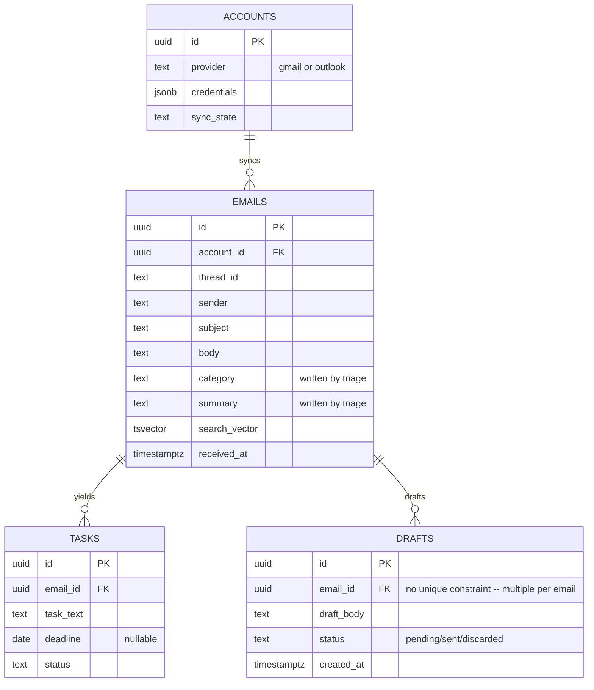

# Supporting View — Data Model

**Editable source:** [04-data-model.drawio](04-data-model.drawio)

Not a C4 level — a supporting view. The database is the contract between the two active containers, so it is worth drawing.

## Who writes what

| Written by | Fields |
|---|---|
| Ingestion + Normaliser | `emails`: account_id, thread_id, sender, subject, body, received_at |
| Triage Pipeline | `emails`: category, summary |
| Action Extraction | `tasks`: entire row |
| Draft Generation | `drafts`: entire row |
| Postgres | `emails.search_vector` (generated / trigger-maintained) |
| Web Dashboard | nothing — reads only |

Splitting the table by writer this way makes the phasing obvious: Phase 1 fills the top block, Phase 2 the second, Phase 3 the third. Each phase is independently verifiable by querying one set of columns.

## The FK that matters

`tasks.email_id` is not bookkeeping — it is the hallucination mitigation. Every extracted action item can be shown beside the email it was drawn from, so a wrong task is visibly wrong rather than quietly authoritative. If that link were optional, the task list would become a set of unverifiable claims.

## Open questions, still unresolved in the proposal

These are carried over rather than silently decided:

- **Deletion propagation.** If an email is deleted or archived at the provider, does the local `emails` row follow? And what happens to a `task` whose source email disappears — cascade, orphan, or tombstone? Cascading would silently delete commitments the user still owes.
- **Token storage.** `accounts.credentials` overlaps with n8n's own credential store. Mirroring tokens in both places means two things to keep in sync and two places to leak from.
- **Backfill policy.** On first connect: recent mail only, or full history? This decides whether `emails` holds hundreds of rows or hundreds of thousands, which in turn decides whether tsvector search is sufficient.
- **Category values.** A fixed enum keeps the inbox scannable and filterable; model-proposed labels drift and fragment. The column is `text` either way, but the constraint belongs in the schema if the enum wins.

## Why no vector column

Semantic search is explicitly out of scope for v1. Postgres `tsvector` covers "find that email about the invoice" for a single user's mailbox. A vector store would be a fourth managed service and a second copy of every email body, for a capability the success criteria never ask for.
