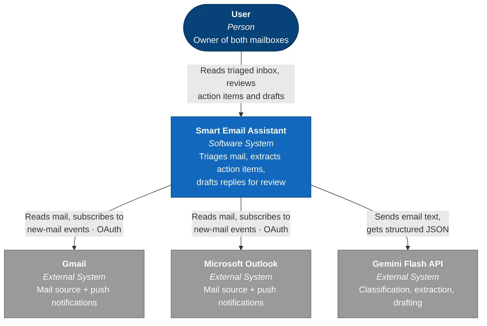
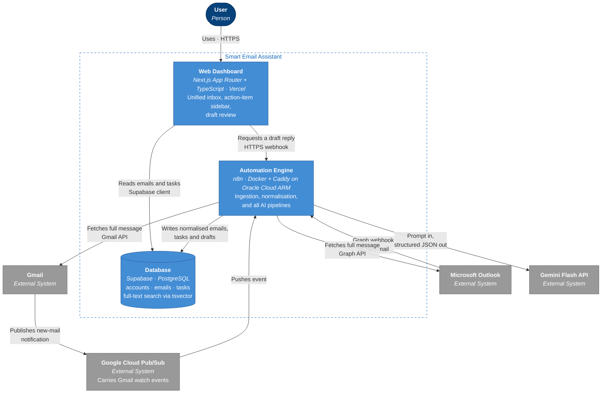
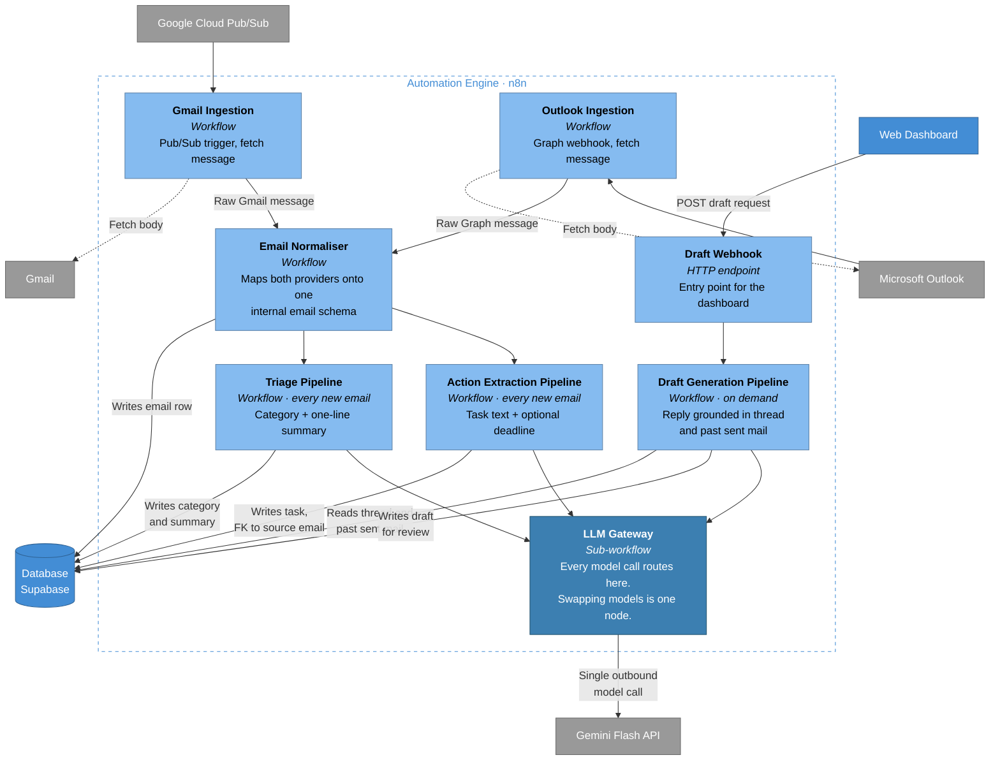
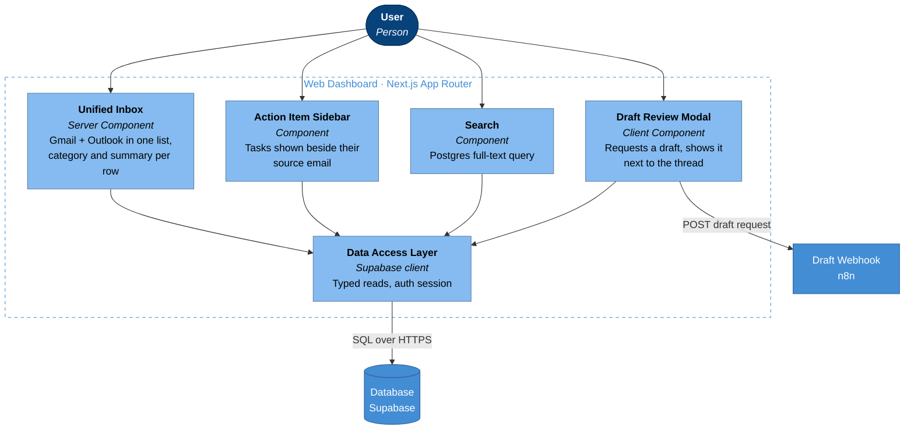
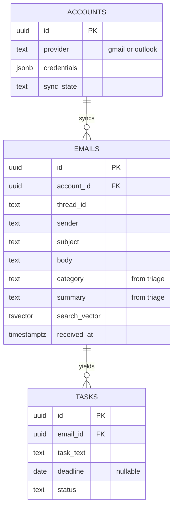
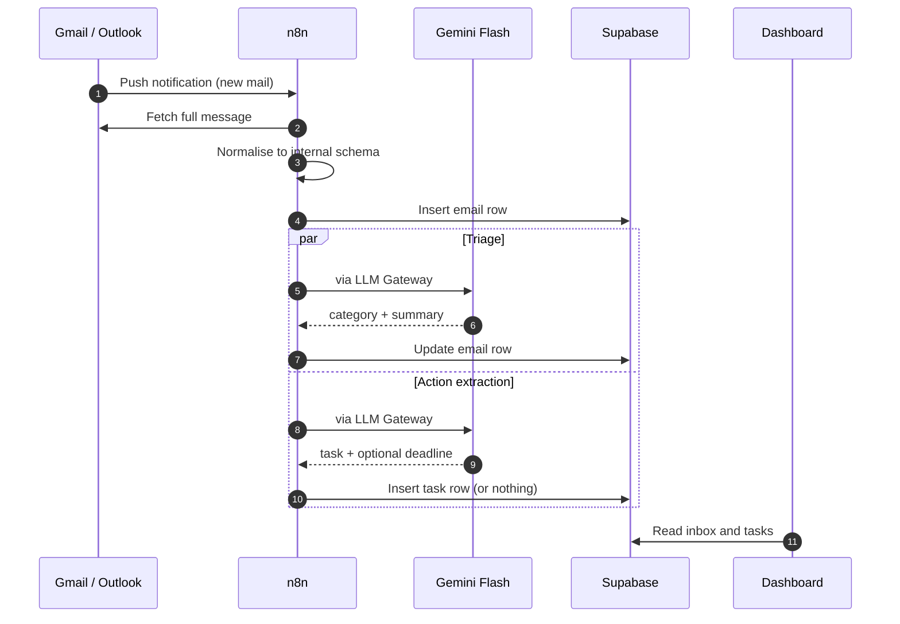

# Smart Email Assistant — Architecture (C4)

Diagrams follow the [C4 model](https://c4model.com): each level zooms one step further in.
Scope is **v1**, as defined in [smart-email-assistant-proposal.md](smart-email-assistant-proposal.md) and [.specclaw/changes/001-smart-email-assistant/proposal.md](.specclaw/changes/001-smart-email-assistant/proposal.md).

**Colour key**

| Colour | Meaning |
|---|---|
| Dark blue | Person |
| Blue | The system, or a container inside it |
| Light blue | A component inside a container |
| Grey | External system we do not own |

---

## Level 1 — System Context

*Who uses it, and what it talks to.*

**Reading the diagram**

- Single user, single system, three externals. Nothing else exists at v1.
- Every arrow to a mail provider is **read-only**. The system never sends mail — that is a hard product rule, not a deferral.

---

## Level 2 — Containers

*The deployable pieces inside the system, and how they communicate.*

**Why the boundaries sit here**

- The frontend never calls an LLM or a mail provider directly. It reads the database, and asks n8n when it needs work done.
- n8n owns every credential and every outbound call, so a provider change stays in one container.
- The database is the only thing both other containers share — it is the contract between them.

---

## Level 3a — Components: Automation Engine (n8n)

*One n8n workflow per box. Everything AI passes through the LLM Gateway.*

**The one rule enforced from day one:** triage, extraction and drafting never call a model directly — they call the **LLM Gateway**. The fallback router (local Ollama, paid escalation) is designed but *not built* in v1; this box is where it attaches later without touching any pipeline.

Two normalisation points are worth noting: provider differences die at the **Email Normaliser**, and model differences die at the **LLM Gateway**. Everything between those two boxes is provider- and model-agnostic.

---

## Level 3b — Components: Web Dashboard (Next.js)

The dashboard has exactly one write path — the draft request — and it goes to n8n, not the database. Everything else is a read.

---

## Supporting view — Data model

---

## Supporting view — New email arriving

---

## Deployment at a glance

| Container | Host | Tier |
|---|---|---|
| Web Dashboard | Vercel | Free |
| Automation Engine (n8n) | Oracle Cloud ARM VM — Docker Compose + Caddy | Free |
| Database | Supabase | Free |
| Pub/Sub transport | Google Cloud | Free |

---

## Deliberately absent from these diagrams

Auto-send, multi-tenancy, a mobile app, calendar integration, semantic/vector search, learned per-sender priority rules, and the fallback model router are all out of scope for v1. The router is *designed* — it attaches at the LLM Gateway — but is not drawn because it is not built.
